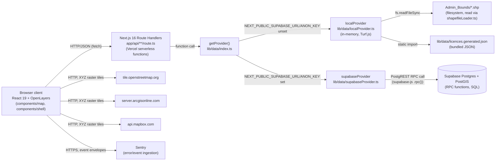
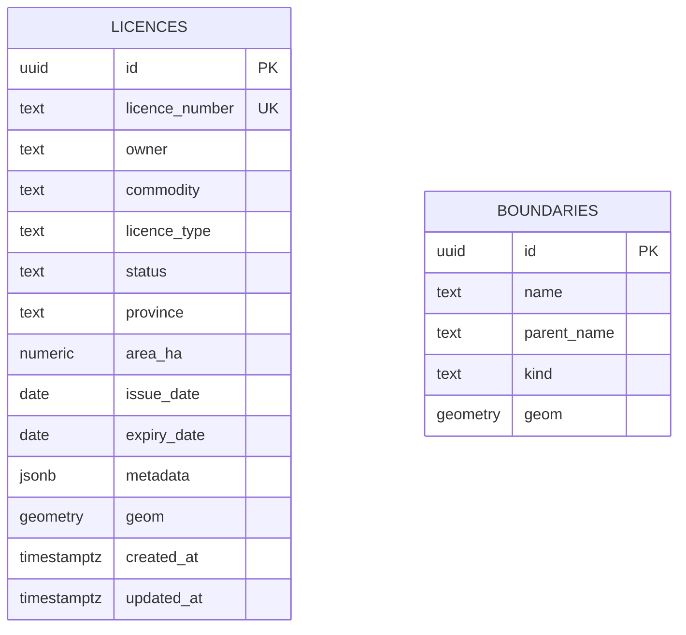
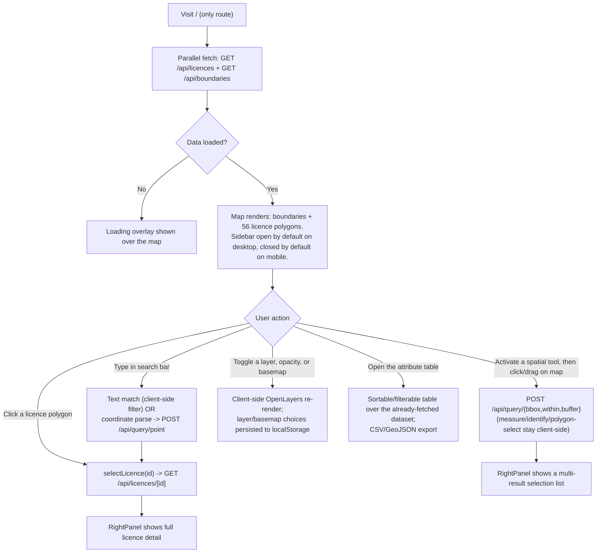

# PROJECT_DOSSIER.md — Mining Cadastre Viewer

**Method note:** every claim below was verified directly against the repository at commit `1554ec8` (2026-08-26) — by reading source files, running `git log`, running `cloc`, running `grep` for TODO/FIXME/HACK/XXX, running `npx playwright test`, and running the app locally with Playwright to capture real timing figures. Nothing here is inferred from the README or from what a typical cadastre system "usually" has. Where the requested prompt template assumes functionality this codebase does not contain (licence applications, overlap-conflict detection between competing applications, authentication/roles, document upload, admin dashboards, notifications), this is stated as `NOT PRESENT` rather than described generically.

**Items from the request I could not fully answer, and why:**
- §10.3/10.4 (run the test suite, get coverage): there is no test suite in the repository. `npx playwright test` was actually run; its exact output is quoted in §10.3. No coverage tool is configured, so there is nothing to run for §10.4.
- §13.1 (reconstruct build order from commit history): the Git history is not usable for this — see §1.4. Almost the entire application was built *before* the repository was placed under version control; the first commit is a single snapshot of the finished app. I substituted the project's own dated development log (`todo.md`) as the evidence source instead, since it does span the real build timeline, and say so explicitly in §13.
- §10.6 (hardware for performance figures): OS and RAM were queried (`systeminfo`); the exact CPU model could not be retrieved (`wmic` is unavailable in the shell used) — reported as `NOT OBTAINED`, not guessed.
- §9.6 (screenshots): produced as a numbered list of what to capture and how to reproduce each screen; no screenshot image files exist in the repo, since none have been captured yet — that's the point of the list.
- §10.6/§12.4 (`/api/boundaries` performance): measured a consistent ~1-1.3s per call across 5 repeats, which does not match what the caching code (`lib/data/adminBoundaries.ts`) says should happen on repeated calls within one warm process. I could not confirm the actual root cause of that discrepancy within this session, and say so explicitly at each mention rather than asserting one.

---

## 1. System overview

### 1.1 What the application does (from the code)

The repository (`app/page.tsx` → `components/shell/AppShell.tsx`) renders a single-page Next.js application consisting of one full-screen interactive map (OpenLayers, `components/map/MapCanvas.tsx`) surrounded by a fixed UI shell: a top bar with search, a collapsible left sidebar (layer controls and a filterable search list), a right-hand detail panel that appears only when something is selected, a floating toolbar of spatial-analysis tools, and a bottom status bar. The map displays two categories of vector data fetched from the app's own API routes: (1) Zambia's real administrative boundaries — national outline, 10 provinces, 116 districts, sourced from shapefiles in `Admin_Bounds/` — and (2) a set of 56 "mining licence" polygons (`lib/data/licences.generated.json`) with status, owner, commodity, area, and date attributes, colour-coded by status. There is no create/update/delete capability anywhere in the UI or API for either dataset — every route under `app/api/` is a `GET` or a read-only `POST` (a spatial *query*, not a mutation). There is no authentication, no user accounts, and no concept of a licence "application" or "submission" anywhere in the code.

### 1.2 Repository structure (3 levels, `node_modules`/`.next`/`.git` excluded)

```
.
├── Admin_Bounds/                 Real Zambia shapefiles (national/province/district), read at request time
│   ├── Zambia Boundary/          National outline (.shp/.dbf/.prj/.shx/.cpg)
│   ├── Zambia Districts/         116 district polygons
│   └── Zambia Provinces/         10 province polygons
├── app/                          Next.js App Router: the one page, and all API route handlers
│   ├── api/                      8 route handlers (licences, licences/[id], boundaries, query/*)
│   ├── favicon.ico, global-error.tsx, globals.css, layout.tsx, page.tsx
├── components/                   All React UI, organized by concern
│   ├── attribute-table/          Data table (sort/filter/export)
│   ├── layers/                   Layer tree + floating legend
│   ├── map/                      OpenLayers canvas, layer factories, styles, controls/
│   ├── search/                   Top-bar search + sidebar filter search
│   ├── shell/                    App shell chrome (TopBar/StatusBar/LeftPanel/RightPanel/…)
│   ├── tools/                    Spatial tool rail, status panel, tool logic
│   └── ui/                       shadcn/ui primitives (button, dialog, table, …)
├── config/                       App-wide constants: basemap registry, CRS/format defaults
├── lib/                          Non-React logic: data providers, CRS math, coordinate parsing, hooks
│   ├── data/                     The DataProvider abstraction (local + Supabase) — see §2, §4
│   └── supabase/                 Supabase client factory (browser + server)
├── public/                       Static assets (stock Next.js SVGs — unmodified from scaffold)
├── ref/                          Original design-reference project (mock data source + unused HTML mockup)
├── scripts/                      One-off data-generation script (licence geometry)
├── store/                        Single Zustand store (`useMapStore.ts`) — all client state
├── supabase/                     SQL migration + seed script for the optional PostGIS backend
├── CLAUDE.md, plan.md, todo.md, session.md   Project documentation/dev-log (not app code)
├── next.config.ts, tsconfig.json, eslint.config.mjs, postcss.config.mjs   Tooling config
├── sentry.server.config.ts, sentry.edge.config.ts, instrumentation*.ts   Sentry scaffold
└── package.json / package-lock.json
```

### 1.3 Line and file counts by language

Measured with `cloc` (`npx cloc@2 --git <HEAD>`), whole repository at commit `1554ec8`:

| Language | Files | Blank | Comment | Code |
|---|---:|---:|---:|---:|
| JSON | 6 | 0 | 0 | 16,971 |
| TypeScript | 84 | 570 | 238 | 4,916 |
| HTML | 3 | 339 | 72 | 4,186 |
| JavaScript | 4 | 36 | 86 | 1,815 |
| Markdown | 6 | 100 | 2 | 407 |
| SQL | 1 | 20 | 22 | 241 |
| CSS | 1 | 6 | 5 | 187 |
| SVG | 5 | 0 | 0 | 5 |
| **Sum** | **110** | **1,071** | **425** | **28,728** |

Two caveats that change what this table actually means:
- **JSON (16,971 lines)** is almost entirely non-source: `package-lock.json` (14,441 lines, machine-generated) + `lib/data/licences.generated.json` (2,412 lines, generated data, not hand-written) account for 16,853 of the 16,971. The real application logic lives almost entirely in the **TypeScript** row (4,916 lines across 84 files).
- **HTML (4,186 lines) and 1,794 of the 1,815 JavaScript lines** are entirely inside `ref/` — the original design-reference mockup. Only one file in `ref/` (`ref/project/cadastre-data.js`) is actually imported by application code (`lib/data/referenceGeometry.ts:45`, used solely by the one-off generator script `scripts/generate-licences.ts`); `ref/project/support.js` and the two HTML files are not referenced anywhere in the app.

### 1.4 Git history summary

- Total commits: **9**
- First commit: `e02e354`, 2026-08-26 15:14:07
- Latest commit: `1554ec8`, 2026-08-26 18:57:24
- Contributors: **1** (`Maadvert`)

**Important limitation:** every commit was made on a single day (2026-08-26), spanning under 4 hours. This is because Git was not installed on the development machine until that point — the entire application (map, all tools, search, layer management, theming, mobile responsiveness) was already fully built beforehand and lands in the repository as one giant `Initial commit`. **The commit history therefore does not reflect the real development timeline** and cannot be used to infer build order (see §13, which uses `todo.md`'s dated entries instead).

All 9 commits, in order:

| Date/time | Hash | Message |
|---|---|---|
| 2026-08-26 15:14 | `e02e354` | Initial commit: Mining Cadastre Viewer |
| 2026-08-26 15:39 | `3895b54` | Fix Turbopack over-tracing of Admin_Bounds shapefiles before deploy |
| 2026-08-26 15:40 | `4ce59ad` | Upgrade Next.js 16.2.10 -> 16.3.3, fixing multiple high-severity CVEs |
| 2026-08-26 15:41 | `da721c6` | Add Mapbox as a basemap option, default to it once configured |
| 2026-08-26 15:54 | `807f786` | Scaffold Sentry error monitoring |
| 2026-08-26 15:55 | `3b5c734` | Log deployment-prep work in todo.md |
| 2026-08-26 18:27 | `d3edf36` | Finish the deferred mobile fixes: sidebar default, touch targets, table overflow |
| 2026-08-26 18:29 | `5f0a4f9` | Log live deployment + mobile follow-up work in todo.md |
| 2026-08-26 18:57 | `1554ec8` | Fix mobile floating-control overlaps: switcher, legend, overview map |

(This is the complete list — there are only 9 commits total, fewer than the 15–25 the template asks for, because deployment/hardening work is the only phase that happened under version control.)

---

## 2. Architecture

### 2.1 Architectural pattern

**Client–server, with a layered, provider-abstracted backend.** Evidence:
- Client: a React 19 single-page app (`app/page.tsx`, `components/shell/AppShell.tsx`) running entirely client-side for the map (`components/map/MapCanvas.tsx:1` — `"use client"`, dynamically imported with `ssr: false` in `AppShell.tsx:22`).
- Server: Next.js Route Handlers under `app/api/**/route.ts` — thin HTTP-to-provider adapters, no business logic of their own (see each handler in §6).
- A layering seam between the API routes and actual data access: every route calls `getProvider()` (`lib/data/index.ts:11`), which returns one of two interchangeable implementations of a single `DataProvider` interface (`lib/data/types.ts:50`) — `localProvider` (in-memory) or `supabaseProvider` (PostGIS via RPC). This is a **Strategy pattern** applied to the whole data-access layer, not just one module.

There is no MVC framework, no ORM, and no microservice boundary — it is one Next.js deployable unit.

### 2.2 Component diagram



### 2.3 Request lifecycle — a concrete trace

Traced action: **a user types coordinates into the top search bar and presses Enter**, since the app has no "submit an application" flow to trace instead — this is the closest full-stack round trip the codebase actually contains (client parsing → validation → API call → provider → spatial query → state update → render).

1. `components/search/TopSearchBar.tsx:48` — `handleSubmit()` fires on Enter (`onKeyDown` at line 101 of the same file).
2. `lib/coord-parse.ts:70` — `parseCoordinateInput(query)` tries UTM (`tryParseUtm`, line 9), then DMS (`tryParseDms`, line 26), then decimal degrees (`tryParseDecimal`, line 50), in that order, returning the first successful match or `null`.
3. If parsed: `TopSearchBar.tsx:52-53` calls `setMarkerPosition()` (Zustand action, `store/useMapStore.ts:189`) and `zoomToLonLat()` (from `components/map/MapContext.tsx`, imperative OpenLayers view animation).
4. `TopSearchBar.tsx:55-59` — `fetch("/api/query/point", { method: "POST", body: { lon, lat } })`.
5. `app/api/query/point/route.ts` — validates `lon`/`lat` are finite numbers (400 if not), calls `getProvider().getLicenceAtPoint(lon, lat)`.
6. `lib/data/index.ts:11-14` — resolves to `localProvider` or `supabaseProvider` depending on env vars.
   - `localProvider.getLicenceAtPoint` (`lib/data/localProvider.ts:80-91`) — builds a Turf point, does `turf.booleanPointInPolygon` against every cached licence polygon (`Array.find`, first match wins).
   - `supabaseProvider` equivalent calls the `licence_at_point(p_lon, p_lat)` SQL function (`supabase/migrations/0001_init.sql:134-158`), which runs `ST_Contains`.
7. Route handler returns `{ licence: PointMatch | null }` as JSON (`app/api/query/point/route.ts`).
8. Back in `TopSearchBar.tsx:60-68` — if a licence was found: `selectLicence(licence.id)` and `flashLicence(licence.id)` (both Zustand actions) are called, and a 1200ms timer clears the flash. If not found: `selectLicence(null)` and a `notice` state string is set and rendered inline (`TopSearchBar.tsx` render section).
9. `selectedLicenceId` changing in the store causes `components/shell/AppShell.tsx:33` (`rightPanelOpen`) to become true, mounting `components/shell/RightPanel.tsx`, which independently fetches `GET /api/licences/${selectedLicenceId}` (`RightPanel.tsx` `useEffect`) to populate the detail view.
10. Separately, `components/map/MapCanvas.tsx`'s licence-styling effect (keyed on `selectedLicenceId`) re-invokes `licenceStyleFunction` (`components/map/styles.ts:22`) so the selected polygon renders with a thicker navy outline.

### 2.4 Where spatial processing happens

**Both client and server, depending on which data provider is active — never in the browser when Supabase is configured.**

- **Server-side, in the database** (when `supabaseProvider` is active): every spatial predicate — containment (`ST_Contains`), nearest-neighbour (`<->` KNN operator + `ST_Distance`), radius search (`ST_DWithin`), bbox intersection (`ST_Intersects`/`ST_MakeEnvelope`), area/perimeter/centroid (`ST_Area`, `ST_Perimeter`, `ST_Centroid`) — runs inside PostgreSQL/PostGIS via the RPC functions in `supabase/migrations/0001_init.sql:65-274`. The Next.js server does no geometry math itself in this mode; it only forwards parameters and returns the JSON PostGIS already built.
- **Server-side, in Node, with Turf.js** (when `localProvider` is active — the default, and what's currently deployed): the same predicates are recomputed in JavaScript inside the Next.js server process (still server-side — the route handlers run in Vercel's serverless functions, not the browser), using `@turf/turf` against an in-memory array built once per process (`lib/data/localProvider.ts:28-43`).
- **Client-side, in the browser:** only *preview* geometry math for tool interactions before a query is even sent — live measurement while dragging (distance/area/centroid, `lib/geo.ts:1-46`), buffer-preview circles for the drag HUD (`lib/geo.ts:37-39`), and UTM/DMS coordinate conversions for display (`lib/crs.ts`). None of this client-side math is authoritative; every tool that returns a licence *result set* does so via a server round trip.

The reason for this split (stated directly in the code comments, `lib/data/localProvider.ts:1-14`): the offline provider exists so the app runs with zero external services during development, at the explicit cost of one accuracy trade-off — see §7.3.

---

## 3. Technology stack

| Component | Technology | Version | Role | Declared in |
|---|---|---|---|---|
| Frontend framework | Next.js (App Router) | `^16.3.3` | Routing, SSR shell, API route handlers, build/deploy target | `package.json` |
| UI library | React / react-dom | `19.2.4` | Component rendering | `package.json` |
| Language | TypeScript | `^5` (strict mode) | Static typing across the whole codebase | `package.json`, `tsconfig.json:7` |
| Styling | Tailwind CSS | `^4` | Utility-first CSS | `package.json`, `app/globals.css:1-2` |
| Component library | shadcn/ui (`base-nova` style, base-ui primitives) | via `shadcn` `^4.13.0`, `@base-ui/react` `^1.6.0` | Buttons, dialogs, popovers, tables, sliders, etc. (`components/ui/*`) | `components.json`, `package.json` |
| State management | Zustand | `^5.0.14` | The single client store (`store/useMapStore.ts`), partially persisted to `localStorage` | `package.json` |
| Mapping engine | OpenLayers (`ol`) + `ol-ext` | `^10.9.0` / `^4.0.38` | The interactive map, all layers, controls, drawing/measurement interactions | `package.json`, `components/map/*` |
| CRS/projection math | proj4 | `^2.20.9` | WGS84 ⇄ UTM conversion | `package.json`, `lib/crs.ts:1` |
| Client geometry ops | Turf.js (`@turf/turf`) | `^7.3.5` | All spatial math (offline provider queries, live-measurement previews) | `package.json`, `lib/geo.ts`, `lib/data/localProvider.ts` |
| Shapefile parsing | `shapefile` npm package | `^0.6.6` | Reads `Admin_Bounds/*.shp`/`.dbf` into GeoJSON | `package.json`, `lib/data/shapefileLoader.ts` |
| CSV export | PapaParse | `^5.5.4` | `AttributeTable`'s CSV export | `package.json`, `components/attribute-table/AttributeTable.tsx` |
| Optional database client | `@supabase/supabase-js` | `^2.110.0` | Talks to Supabase's PostgREST API (only when configured) | `package.json`, `lib/supabase/*`, `lib/data/supabaseProvider.ts` |
| Error monitoring | `@sentry/nextjs` | `^10.71.0` | Scaffolded (see §3.8) — inert with no DSN set | `package.json`, `next.config.ts:2,21`, `instrumentation.ts`, `sentry.*.config.ts` |
| Build tool / bundler | Turbopack (via `next build`/`next dev`) | bundled with Next 16 | Compilation, dev server, production bundling | `package.json` scripts |
| Package manager | npm | `11.13.0` (observed) | Dependency management, lockfile | `package-lock.json` |
| JS runtime (dev) | Node.js | `v24.16.0` (observed) | Local dev/build execution | *(no `engines` field in `package.json` — not pinned)* |
| Script runner | `tsx` | `^4.23.0` | Runs the seed script and the licence-generator script directly from TypeScript | `package.json` |
| Linting | ESLint (`eslint-config-next`) | `^9` / `^16.3.3` | `npm run lint` | `eslint.config.mjs`, `package.json` |
| Formatting | Prettier (+ `prettier-plugin-tailwindcss`) | `^3.9.4` | Code formatting | `.prettierrc.json`, `package.json` |
| Dev/test automation | Playwright | `^1.61.1` | Present as a devDependency; **no test files exist** — used only for ad-hoc manual verification, never as part of `npm run` scripts | `package.json` (no test script defined) |

### 3.4 Database and spatial extension

**PostgreSQL + PostGIS**, via Supabase, `create extension if not exists postgis;` (`supabase/migrations/0001_init.sql:4`). Exact PostGIS version is not pinned anywhere in the repo (Supabase manages the extension version at the project level; there is no live Supabase project provisioned as of this dossier — see §4.6).

### 3.5 Map/tile server

**NOT PRESENT as a self-hosted component.** No GeoServer/MapServer/pg_tileserv/Martin exists in the repo. All basemap tiles are fetched directly by the browser from third-party XYZ tile endpoints — OpenStreetMap, Esri ArcGIS Online, Mapbox Styles API, and (gated behind an API key) Google Maps — configured in `config/basemaps.ts:19-67`, using OpenLayers' generic `XYZ` source (`components/map/basemapLayer.ts`). The application's own vector data (boundaries, licences) is served as plain GeoJSON over the app's own API routes, not as map tiles.

### 3.6 Authentication/authorisation libraries

**NOT PRESENT.** No auth library appears in `package.json` (no NextAuth, no Passport, no Supabase Auth usage). A repository-wide search for JWT/session/login/password patterns across `app/`, `components/`, `lib/`, `store/`, `config/` returned zero matches. See §8.

### 3.8 External/third-party services called at runtime

| Service | Endpoint | Used for | Requires |
|---|---|---|---|
| OpenStreetMap tile server | `https://tile.openstreetmap.org/{z}/{x}/{y}.png` | Default basemap ("Streets") when no Mapbox token is set | No key; explicitly documented in the code as unsuitable for production traffic under OSM's own usage policy (`config/basemaps.ts` comment) |
| Esri ArcGIS Online | `https://server.arcgisonline.com/ArcGIS/rest/services/{World_Imagery,World_Topo_Map}/MapServer/tile/{z}/{y}/{x}` | "Satellite" and "Terrain" basemap options | No key |
| Mapbox Styles API | `https://api.mapbox.com/styles/v1/mapbox/{streets-v12,satellite-streets-v12}/tiles/256/{z}/{x}/{y}@2x` | "Mapbox Streets"/"Mapbox Satellite" basemap options; becomes the default once configured | `NEXT_PUBLIC_MAPBOX_TOKEN` |
| Google Maps tiles | `https://mt1.google.com/vt/lyrs={m,s}&x={x}&y={y}&z={z}&key=…` | Optional "Google Streets"/"Google Satellite" basemaps | `NEXT_PUBLIC_GOOGLE_MAPS_KEY` |
| Supabase (PostgREST) | project-specific URL | Optional PostGIS-backed data provider | `NEXT_PUBLIC_SUPABASE_URL` + `NEXT_PUBLIC_SUPABASE_ANON_KEY` (not currently provisioned in the live deployment) |
| Sentry | project-specific DSN | Error/event ingestion | `NEXT_PUBLIC_SENTRY_DSN` (currently **unset** in the live deployment — SDK is a documented no-op without it) |

No geocoder, email, SMS, or payment service exists anywhere in the codebase.

### 3.9 Deployment/hosting configuration

- **No Dockerfile, no `docker-compose.yml`, no `.github/` CI workflows exist in the repository** (confirmed by direct filesystem check).
- Deployment target: **Vercel**, deployed directly from the GitHub repository (`git remote -v` → `https://github.com/tawandam777/Zed_Mining_Cadastre.git`), no CI pipeline beyond Vercel's own build-on-push.
- `next.config.ts` — the one deployment-relevant piece of config in the repo: sets `outputFileTracingIncludes` to explicitly scope the shapefile/generated-JSON files into every `/api/**` serverless function's bundle (see the in-code comment, `next.config.ts:5-14`, and §12), and wraps the config with `withSentryConfig` (`next.config.ts:21-25`).
- Environment variables the app reads (all optional except none — the app runs with **zero** set, by design): `NEXT_PUBLIC_SUPABASE_URL`, `NEXT_PUBLIC_SUPABASE_ANON_KEY`, `SUPABASE_SERVICE_ROLE_KEY` (seed script only, never read by the deployed app), `NEXT_PUBLIC_GOOGLE_MAPS_KEY`, `NEXT_PUBLIC_MAPBOX_TOKEN`, `NEXT_PUBLIC_SENTRY_DSN`, `SENTRY_ORG`, `SENTRY_PROJECT`, `SENTRY_AUTH_TOKEN` — all documented with no real values in `.env.local.example`.

---

## 4. Data model

The schema below exists as SQL in the repository (`supabase/migrations/0001_init.sql`) and is used when `supabaseProvider` is active. **As of this dossier, no live Supabase project is provisioned** — the deployed application runs on `localProvider` instead, which holds the equivalent data as a static bundled JSON file plus shapefiles (no live "database" in that mode at all). Both are documented here since both are real, working code paths.

### 4.1 Tables

| Table | Purpose | One row = |
|---|---|---|
| `licences` | Mining licence records with geometry and attributes | one mining licence |
| `boundaries` | Administrative boundary polygons (national/province/district), tagged by kind | one administrative area (one country outline, one province, or one district) |

### 4.2 Field-level detail

**`licences`** (`supabase/migrations/0001_init.sql:10-25`)

| Field | Type | Constraints | Description |
|---|---|---|---|
| `id` | `uuid` | PK, default `gen_random_uuid()` | Row identity |
| `licence_number` | `text` | `not null`, `unique` | Human-readable licence code (e.g. `LSM-2024-0147`) |
| `owner` | `text` | `not null` | Owning company/individual name |
| `commodity` | `text` | `not null` | Free text — see §4.5 for the observed value set |
| `licence_type` | `text` | `not null` | Free text — see §4.5 |
| `status` | `text` | `not null`, `check (status in ('Active','Pending','Reserved','Suspended','Expired','Cancelled'))` | **The only DB-enforced enum in the schema** |
| `province` | `text` | nullable | Free text, no FK to `boundaries` |
| `area_ha` | `numeric` | nullable | Declared area in hectares |
| `issue_date` | `date` | nullable | — |
| `expiry_date` | `date` | nullable | — |
| `metadata` | `jsonb` | `not null default '{}'` | Unused extension point — always empty in both providers |
| `geom` | `geometry(MultiPolygon, 4326)` | `not null` | The licence boundary |
| `created_at` / `updated_at` | `timestamptz` | `not null default now()` | Set once on insert; **nothing in the app ever updates a row**, so `updated_at` never diverges from `created_at` in practice |

Indexes: `licences_geom_gix` (GiST, on `geom`), plus btree indexes on `status`, `commodity`, `licence_type`, `province`, `licence_number` (lines 27-32).

**`boundaries`** (lines 36-42)

| Field | Type | Constraints | Description |
|---|---|---|---|
| `id` | `uuid` | PK, default `gen_random_uuid()` | Row identity |
| `name` | `text` | `not null default ''` | Boundary name (e.g. "Copperbelt") |
| `parent_name` | `text` | nullable | For districts, the owning province's name — **plain text, not a foreign key** |
| `kind` | `text` | `not null`, `check (kind in ('national','province','district'))` | Second DB-enforced enum |
| `geom` | `geometry(Geometry, 4326)` | `not null` | Polygon or MultiPolygon depending on source shapefile |

Indexes: `boundaries_geom_gix` (GiST), `boundaries_kind_idx` (btree).

### 4.3 Geometry columns

| Table | Column | Type | SRID | Reason (from code/comments) |
|---|---|---|---|---|
| `licences` | `geom` | `MultiPolygon` | 4326 (WGS84) | Matches the app's stated CRS model — "internal storage/API is WGS84 GeoJSON… UTM zone is derived at display time" (`CLAUDE.md`); confirmed in code by every RPC casting to `::geography` for metric calculations rather than storing a projected CRS |
| `boundaries` | `geom` | `Geometry` (mixed Polygon/MultiPolygon) | 4326 | Same — sourced directly from WGS84 shapefiles, no reprojection (`CLAUDE.md`: "WGS84, no reprojection needed") |

### 4.4 Entity-relationship diagram



**No relationship line is drawn between the two entities because none exists in the schema.** `licences.province` and `boundaries.parent_name` are both plain, unconstrained `text` columns — there is no foreign key anywhere in the database, and the application never performs a SQL join between the two tables. Any province/district association a user sees on screen is computed independently (client-side point-in-polygon at data-generation time for `licences.province` — see §7.4 — and by the boundary-loading code tagging each shapefile row with its own `kind`/`parent_name` at load time, `lib/data/adminBoundaries.ts`).

### 4.5 Enumerations and controlled vocabularies

| Name | Values | Enforcement | Defined in |
|---|---|---|---|
| Licence status | `Active`, `Pending`, `Reserved`, `Suspended`, `Expired`, `Cancelled` | **Database-enforced** (`CHECK` constraint) *and* re-declared as a TypeScript union | `supabase/migrations/0001_init.sql:16`; `lib/theme.ts:1,3` (`LicenceStatus`, `STATUS_LIST`) |
| Boundary kind | `national`, `province`, `district` | Database-enforced (`CHECK` constraint) | `supabase/migrations/0001_init.sql:40` |
| Licence type | Observed values in the current dataset: `Large-Scale Mining`, `Small-Scale Mining`, `Exploration`, `Mineral Processing`, `Artisanal` | **Not enforced** — plain `text` column, no CHECK constraint, no TypeScript union restricting it | Values only exist as data in `lib/data/licences.generated.json`; the field type is `licenceType: string` in `lib/types.ts` |
| Commodity | Observed values: `Copper`, `Gold`, `Lead/Zinc`, `Manganese`, `Cobalt`, `Emerald` | **Not enforced**, same as above | Same |
| Province (on licences) | Observed: `North-Western`, `Copperbelt`, `Western`, `Central`, `Muchinga`, `Eastern`, `Luapula`, `Lusaka`, `Northern`, `Southern` (all 10 real Zambian provinces) | **Not enforced** as a controlled list on `licences`; the *boundary* dataset's province names are whatever the source shapefile contains | Computed at generation time via real point-in-polygon lookup (`scripts/generate-licences.ts`, using `lib/data/adminBoundaries.ts`'s `findProvinceForPoint()`) |
| User roles | **NOT PRESENT** — no role concept exists anywhere | — | — |

### 4.6 Migrations and seed data

- **One** migration file exists: `supabase/migrations/0001_init.sql` (241 lines of SQL — see §1.3). There is no sequence of incremental migrations; the schema was written once, in full.
- Seed data: `supabase/seed/seed.ts` populates both tables from **the same generated/synthetic dataset the offline provider uses** (`lib/data/licences.generated.json`) plus the real shapefiles (`Admin_Bounds/`). It is not real government cadastre data — see §12.5. The seed script clears both tables (`.delete().not("id","is",null)`, lines 89-90) before inserting, i.e. it is fully idempotent/re-runnable, not additive.
- **This migration has never been run against a live database as of this dossier.** The deployed application uses `localProvider` exclusively (confirmed: no `NEXT_PUBLIC_SUPABASE_URL` is set in the Vercel project). The SQL is real, tested-by-inspection code, but currently dormant.

### 4.7 CRS transformations in code

- `lib/crs.ts:19-24` — WGS84 lon/lat → UTM, auto-selecting the UTM zone from longitude (`utmZoneFromLon`, line 10-12: `Math.floor((lon + 180) / 6) + 1`), via `proj4`.
- `lib/crs.ts:27-30` — UTM → WGS84 (inverse of the above), used when parsing a UTM coordinate typed into search (`lib/coord-parse.ts:9-20`).
- OpenLayers itself reprojects WGS84 (EPSG:4326, the storage/API CRS) to Web Mercator (EPSG:3857, the display CRS) internally on every GeoJSON read (`featureProjection: "EPSG:3857", dataProjection: "EPSG:4326"` — set identically in `components/map/licenceLayer.ts:6` and `components/map/boundaryLayer.ts:5`).
- No server-side reprojection occurs — PostGIS stores and returns 4326 directly; area/length calculations use the `::geography` cast (spherical calculation) rather than reprojecting to a local projected CRS (see §7.3 for the accuracy implication).

---

## 5. Functional modules

There is no role system, so "user role(s) that can access it" is the same for every module below: **the single, unauthenticated public visitor.**

### 5.1 Map viewer and layer control
- **What it does:** renders the base map, three independent administrative boundary layers, and the licence layer; lets the user toggle visibility and opacity per layer independently, and switch basemap provider.
- **Files:** `components/map/MapCanvas.tsx` (OpenLayers orchestration), `components/map/boundaryLayer.ts`, `components/map/licenceLayer.ts`, `components/map/basemapLayer.ts`, `components/layers/LayerTree.tsx` (sidebar controls), `components/map/controls/BasemapSwitcher.tsx`, `store/useMapStore.ts` (visibility/opacity state).
- **API endpoints used:** `GET /api/boundaries`, `GET /api/licences`.
- **Inputs:** checkbox toggles, opacity sliders (0–1), basemap selection.
- **Validation:** none needed (all inputs are UI-constrained, e.g. a slider can't produce an out-of-range value).
- **Known limitations:** the offline `localProvider`'s boundary/licence data has no live update mechanism — refreshing the browser re-fetches the same static bundle every time (no cache-busting concern, but also no way for the underlying data to change without a redeploy in offline mode).

### 5.2 Licence search and filtering
- **What it does:** two independent search surfaces — a top-bar quick search (text, capped at 8 results, with a "see all N results" handoff) and a sidebar filter panel (text + commodity/status/province dropdowns, full result list).
- **Files:** `components/search/TopSearchBar.tsx`, `components/search/FilterSearchPanel.tsx`, `lib/useLicences.ts` (shared cached fetch both search UIs read from).
- **API endpoints used:** none directly for filtering — both search UIs filter the already-fetched full `GET /api/licences` result client-side (`Array.filter` over the in-memory GeoJSON, e.g. `FilterSearchPanel.tsx`'s `results` `useMemo`).
- **Inputs:** free text (min length 2 to show top-bar results), dropdown selections.
- **Validation:** none beyond the length check; no server round trip to validate.
- **Known limitations:** filtering happens entirely client-side over the full dataset — fine at 56 features, would not scale to a large real dataset without server-side filtering/pagination (see §12.4).

### 5.3 Coordinate search
- **What it does:** parses free-form coordinate input (UTM, DMS, or decimal degrees), pans/zooms the map there, and performs a server-side point-in-polygon lookup to select any licence at that point.
- **Files:** `lib/coord-parse.ts`, `lib/crs.ts`, `components/search/TopSearchBar.tsx:48-77`.
- **API endpoint:** `POST /api/query/point`.
- **Inputs:** a string in one of three formats (see §7.4 for exact grammar).
- **Validation:** `lon`/`lat` must be finite numbers server-side (`app/api/query/point/route.ts`); unparseable input is silently treated as a text search instead (no error shown for that case specifically) — see `TopSearchBar.tsx:65` (`if (results.length > 0)` fallback).
- **Output:** a "No mining licence exists at this location" notice if nothing is found (line 67), otherwise the licence is selected and briefly flash-highlighted.

### 5.4 Spatial tools (drawing/measurement/selection)
- **What it does:** measure distance, measure area, identify a clicked feature, buffer-select around a point (radius slider), and select-by-rectangle/circle/polygon.
- **Files:** `components/tools/ToolRail.tsx` (activation UI), `components/tools/ToolStatusPanel.tsx` (instructions + live/final readouts), `components/tools/useSpatialTools.ts` (click/drag handling logic), `components/tools/liveMeasurement.ts` (cursor-following HUD text), `components/map/toolLayer.ts` (the drawn overlay geometry).
- **API endpoints used:** `POST /api/query/bbox` (rectangle select), `POST /api/query/within` (circle select), `POST /api/query/buffer` (buffer tool). Measure/identify/polygon-select do not call the server — measure distance/area is pure client-side Turf math (`lib/geo.ts`), identify uses OpenLayers' own hit-testing against already-loaded features, and polygon-select filters the already-loaded dataset client-side.
- **Validation:** server-side, identical numeric-finiteness checks as coordinate search (see each route in §6).
- **Known limitations:** "Nearest licence" has a working provider method and RPC function (`getNearestLicence`, `nearest_licence` SQL function) but **no UI button wired to it anywhere** — reachable only by calling the API directly. This is explicitly logged as a known gap in `todo.md` ("Deferred to Phase 2… dedicated 'Nearest Licence' UI button").

### 5.5 Overlap/conflict detection
**NOT PRESENT as a live application feature.** There is no concept of a submitted "application" to conflict-check against another one. The only overlap logic in the entire codebase is a one-off, build-time check inside the licence-*generation* script (`scripts/generate-licences.ts`), which verifies the synthetic polygons it produces don't overlap each other before writing `licences.generated.json` — this runs once, offline, when regenerating the demo dataset, never at request time, and has nothing to do with real-time conflict detection between user-submitted claims. See §7.2 for exactly what it checks.

### 5.6 Licence application submission, lifecycle/status transitions, expiry/renewal handling, document upload
**NOT PRESENT.** No form, route, or database mutation exists for any of these. `status` values exist as static, pre-set data (see §4.5) with no code path that ever changes a `status` value at runtime. There is no file-upload UI or storage bucket configuration anywhere in the repo.

### 5.7 Reporting and export
- **What it does:** exports the (filtered) attribute table as CSV or GeoJSON.
- **Files:** `components/attribute-table/AttributeTable.tsx` (`exportCsv`/`exportGeoJson` functions, using `papaparse` for CSV).
- **Output formats implemented:** CSV, GeoJSON. **PDF, shapefile, and KML export are NOT PRESENT** — no libraries for any of them appear in `package.json`, and no export button/route exists for them.
- **Validation:** none needed — export operates on whatever the table's current client-side filter/sort state already is.

### 5.8 Administrative dashboard, audit logging, notifications, public-vs-authenticated views
**NOT PRESENT**, all four. There is exactly one view, seen identically by every visitor (see §5's opening note and §8).

### 5.9 Attribute table
- **What it does:** a sortable, filterable, paginated (12 rows/page) table of every licence, with row-click zoom-to-feature.
- **Files:** `components/attribute-table/AttributeTable.tsx`.
- **API:** none — operates on the same shared `useLicences()` cached fetch as everything else.

---

## 6. API reference

### 6.1 Endpoint table

None of these endpoints require authentication or have any role restriction — there is no auth system (§8).

| Method | Path | Auth | Role(s) | Purpose | Request | Response | Status codes | Handler |
|---|---|---|---|---|---|---|---|---|
| GET | `/api/licences` | none | — | All licences, optionally clipped to a bbox | Query params `xmin,ymin,xmax,ymax` (all-or-nothing) | `LicenceFeatureCollection` (GeoJSON) | 200, 500 | `app/api/licences/route.ts` |
| GET | `/api/licences/[id]` | none | — | Single licence detail incl. geometry stats | path param `id` | `LicenceDetail` | 200, 404, 500 | `app/api/licences/[id]/route.ts` |
| GET | `/api/boundaries` | none | — | National + province + district boundaries | none | `{ national, provinces, districts }` (3 GeoJSON collections) | 200, 500 | `app/api/boundaries/route.ts` |
| POST | `/api/query/point` | none | — | Point-in-polygon lookup | `{ lon, lat }` | `{ licence: PointMatch \| null }` | 200, 400, 500 | `app/api/query/point/route.ts` |
| POST | `/api/query/bbox` | none | — | Licences intersecting a bbox | `{ xmin, ymin, xmax, ymax }` | `{ licences: RegionMatch[] }` | 200, 400, 500 | `app/api/query/bbox/route.ts` |
| POST | `/api/query/nearest` | none | — | Nearest licence to a point | `{ lon, lat }` | `{ licence: NearestMatch \| null }` | 200, 400, 500 | `app/api/query/nearest/route.ts` |
| POST | `/api/query/within` | none | — | Licences within N metres of a point | `{ lon, lat, meters }` | `{ licences: RegionMatch[] }` | 200, 400, 500 | `app/api/query/within/route.ts` |
| POST | `/api/query/buffer` | none | — | Licences within a radius (km) of a point | `{ lon, lat, radiusKm }` | `{ licences: RegionMatch[] }` | 200, 400, 500 | `app/api/query/buffer/route.ts` |

### 6.2 Exact request/response bodies for the three most important endpoints

**`GET /api/licences`** (no request body). Response (truncated to one feature, real data):
```json
{
  "type": "FeatureCollection",
  "features": [
    {
      "type": "Feature",
      "id": "LSM-2024-0147",
      "properties": {
        "id": "LSM-2024-0147",
        "licenceNumber": "LSM-2024-0147",
        "owner": "Kabwe Copper Resources Ltd",
        "commodity": "Copper",
        "licenceType": "Large-Scale Mining",
        "status": "Active",
        "province": "North-Western",
        "areaHa": 2450,
        "issueDate": "2024-03-12",
        "expiryDate": "2049-03-11"
      },
      "geometry": {
        "type": "Polygon",
        "coordinates": [[[24.683, -12.9496], [24.729, -12.9496], [24.729, -12.905], [24.683, -12.905], [24.683, -12.9496]]]
      }
    }
  ]
}
```
(56 features total in the current dataset.)

**`POST /api/query/point`** — request:
```json
{ "lon": 27.85, "lat": -13.13 }
```
Response when a licence contains the point:
```json
{
  "licence": {
    "id": "…", "licenceNumber": "…", "owner": "…", "commodity": "…",
    "licenceType": "…", "status": "…", "province": "…", "areaHa": 0,
    "issueDate": "…", "expiryDate": "…",
    "geometry": { "type": "Polygon", "coordinates": [ /* … */ ] },
    "centroid": { "type": "Point", "coordinates": [0, 0] }
  }
}
```
Response when nothing is found: `{ "licence": null }` (source: `app/api/query/point/route.ts`, `lib/data/types.ts:3-16` for the exact `PointMatch` shape).

**`POST /api/query/buffer`** — request:
```json
{ "lon": 27.85, "lat": -13.13, "radiusKm": 50 }
```
Response:
```json
{
  "licences": [
    { "id": "…", "licenceNumber": "…", "owner": "…", "status": "…", "geometry": { "type": "Polygon", "coordinates": [ /* … */ ] } }
  ]
}
```
(`RegionMatch` shape, `lib/data/types.ts:28-35` — note `distanceMeters` is optional on this type and is *not* populated by the buffer query, only by `within`/`nearest`.)

### 6.3 Error-handling convention

Every route handler follows the identical pattern (verified across all 8 files):
```ts
try {
  // … call getProvider().<method>(...)
} catch (err) {
  return NextResponse.json({ error: (err as Error).message }, { status: 500 });
}
```
- All server errors surface as `{ "error": "<message>" }` with HTTP 500.
- The 4 `POST` query routes additionally return `{ "error": "<field> must be numbers" }` with HTTP 400 for malformed input, checked *before* the try/catch (e.g. `app/api/query/point/route.ts`).
- `GET /api/licences/[id]` additionally returns `{ "error": "Licence not found" }` with 404 when the provider returns `null`.
- **UI-side error propagation is inconsistent between features:** `TopSearchBar.tsx`'s coordinate search wraps its fetch in try/catch and shows a user-facing "Coordinate lookup failed." notice (line 70). The spatial tools (`useSpatialTools.ts`) and the licence-detail fetch in `RightPanel.tsx` do **not** have equivalent user-facing error handling — a failed fetch there fails silently (caught only by a `.catch(() => { setDetail(null) })`-style swallow in `RightPanel.tsx`, with no message shown to the user). This is a genuine inconsistency, not a deliberate design choice documented anywhere.

---

## 7. Spatial logic and algorithms

### 7.1 Every spatial operation, function-by-function

| Operation | PostGIS (when `supabaseProvider` active) | Turf/JS (when `localProvider` active) | File:line | Units/CRS |
|---|---|---|---|---|
| Containment (point-in-polygon) | `ST_Contains(l.geom, ST_SetSRID(ST_MakePoint(p_lon,p_lat),4326))` | `turf.booleanPointInPolygon(pt, l.polygon)` | `0001_init.sql:156`; `localProvider.ts:83` | Geographic, degrees (4326) |
| Nearest neighbour | `order by l.geom <-> ST_SetSRID(ST_MakePoint(...),4326) limit 1` (KNN index scan) + `ST_Distance(l.geom::geography, …)` for the reported distance | Linear scan over all licences, `turf.distance(pt, turf.point(l.centroid), {units:"kilometers"})`, keeps the minimum | `0001_init.sql:178,175`; `localProvider.ts:93-113` | Metres (PostGIS, geography cast) / km→m (Turf) |
| Radius search | `ST_DWithin(l.geom::geography, ST_SetSRID(...)::geography, p_meters)` | Linear scan, `turf.distance(...) * 1000 <= meters` | `0001_init.sql:201`; `localProvider.ts:115-133` | Metres |
| Bbox intersection | `ST_Intersects(l.geom, ST_MakeEnvelope(xmin,ymin,xmax,ymax,4326))` | `turf.booleanIntersects(l.polygon, turf.bboxPolygon([...]))` | `0001_init.sql:225,101`; `localProvider.ts:58,139` | Degrees |
| Buffer-radius search | `ST_DWithin(l.geom::geography, …, p_radius_km * 1000)` | Linear scan, `turf.distance(...) <= radiusKm` | `0001_init.sql:246-250`; `localProvider.ts:153` | Km→m (PostGIS) / km (Turf) |
| Area | `ST_Area(l.geom::geography) / 1000000.0` | `turf.area(l.polygon) / 1_000_000` | `0001_init.sql:126`; `localProvider.ts:74` | km² (both) |
| Perimeter | `ST_Perimeter(l.geom::geography) / 1000.0` | `turf.length(turf.lineString(l.ring), {units:"kilometers"})` | `0001_init.sql:127`; `localProvider.ts:75` | km |
| Centroid | `ST_Centroid(l.geom)` | `turf.centroid(l.polygon)` | `0001_init.sql:125`; `localProvider.ts:35` | Degrees (a coordinate, not a distance) |
| Client-side live measurement (drag preview only, never authoritative) | n/a | `turf.distance`, `turf.length`, `turf.area`, `turf.centroid`, `turf.buffer` | `lib/geo.ts:1-46` | km / km² |

### 7.2 Overlap detection — exact scope

There is **no runtime overlap/conflict-detection feature** (see §5.5). The only overlap-checking code in the repository is inside `scripts/generate-licences.ts`, a one-off, developer-run generator (not part of the deployed app) that builds the synthetic demo dataset. Per its own documented history (`todo.md`), it originally trusted `turf.booleanOverlap` and hit a false-positive on exactly edge-adjacent rectangles (two polygons sharing a boundary edge with zero real overlap area, which `booleanOverlap` still flagged `true`); it was rewritten to test actual intersection *area* directly (with a bounding-box pre-filter for speed), and the packing algorithm itself now leaves a small explicit gap (`GAP_DEG`) between adjacent generated parcels so edges are never numerically coincident. This is generation-time data hygiene, not a product feature end users interact with.

### 7.3 Area computation — units and CRS accuracy

Both providers report area in **km²** (and hectares, from the stored `area_ha` attribute, which is a static input value, not computed). Neither provider reprojects to a local projected/planar CRS before computing area:
- PostGIS casts to the `geography` type (`l.geom::geography`) before calling `ST_Area`, which computes area on a spherical/ellipsoidal model directly from geographic (lon/lat) coordinates — accurate globally, not dependent on a chosen local projection, at the cost of being slightly more computationally expensive than a planar calculation on projected coordinates.
- Turf's `area()` function performs an equivalent spherical-excess calculation directly on WGS84 coordinates.
- **Accuracy implication:** because neither path uses a projected CRS (e.g., a Zambia-specific UTM zone) for the area math itself, there is no meaningful accuracy loss from projection distortion — both methods are geodesically correct for this purpose. The one real accuracy trade-off is the one already documented in the code (`lib/data/localProvider.ts:9-13`): the offline provider's *nearest/within/buffer* queries measure distance to each licence's **centroid**, not true polygon-boundary distance, so a large polygon very close to a query point on its edge could be reported as farther away than it actually is. This does not affect the area/perimeter calculations, only the three distance-based queries.

### 7.4 Coordinate input formats and conversion code

All parsing lives in `lib/coord-parse.ts:70` (`parseCoordinateInput`), tried in this order:
1. **UTM** — regex `^(\d{1,2})\s*([NnSs])\s+([\d.]+)\s+([\d.]+)$` (zone, hemisphere, easting, northing), converted via `utmToLonLat()` (`lib/crs.ts:27-30`, `proj4`).
2. **DMS** — regex `([NSEWnsew])?\s*(\d{1,3})[°:\s]+(\d{1,2})['\s]+([\d.]+)["\s]*([NSEWnsew])?`, requires at least 2 matches (one lat, one lon, identified by their N/S/E/W letter), converted via `dmsToDecimal()`.
3. **Decimal degrees** — two numbers separated by whitespace/comma/semicolon, with a heuristic swap if the first value can't be a valid latitude (`|value| > 90`) but the second could be (`tryParseDecimal`, lines 50-67).

**Cadastral block/grid references are NOT PRESENT** as an input format — only the three above.

### 7.5 Spatial indexing, query optimisation, simplification, tiling, clustering

- **Indexing:** GiST spatial indexes on both geometry columns (`licences_geom_gix`, `boundaries_geom_gix`) plus btree indexes on the fields most likely to be filtered on (`status`, `commodity`, `licence_type`, `province`, `licence_number`, `kind`) — `0001_init.sql:27-32,44-45`. These only take effect when `supabaseProvider` is active; the offline provider has no index of any kind, doing linear scans over a 56-element array (adequate at this scale, see §12.4).
- **Geometry simplification:** NOT PRESENT — full-resolution geometry is sent and rendered in every case, including the 116-district boundary layer.
- **Tiling/vector-tile serving:** NOT PRESENT — everything is plain GeoJSON, no MVT/PBF encoding anywhere.
- **Clustering:** NOT PRESENT — no marker/point clustering exists (there are no point features requiring it; licences are polygons).
- **Query result caching:** the client caches one thing — `lib/useLicences.ts` module-level `cachedPromise` ensures the full licence collection is fetched exactly once per page load and shared across every component that needs it (this was previously a duplicate-fetch bug, fixed — see `todo.md`'s Rendering Performance entry).

### 7.6 Performance-sensitive queries / complexity concerns

- `localProvider`'s nearest-neighbour and within-distance queries are **O(n)** linear scans (`localProvider.ts:93-113,115-133`) — fine at 56 features, would degrade linearly with dataset size since there is no spatial index in the offline mode by construction (it's a plain in-memory array).
- The `supabaseProvider` equivalents are index-accelerated (GiST + KNN `<->` operator), so this concern is specific to the offline provider, not the architecture overall.
- Client-side: `FilterSearchPanel.tsx` and `TopSearchBar.tsx` both re-filter the **entire** licence array on every keystroke via `useMemo` with no debounce — cheap today at 56 rows, would become a per-keystroke cost concern on a much larger dataset (see §12.4).

---

## 8. Security, roles and access control

### 8.1 Authentication mechanism
**NOT PRESENT.** No session, JWT, OAuth, password hashing, or login flow exists anywhere in the codebase (verified by a repository-wide grep for auth-related patterns — zero matches outside `node_modules`). The application is entirely public and unauthenticated; Supabase Row Level Security is configured for the **`anon`** role only (see §8.3) — there is no `authenticated`-tier behavior difference anywhere in the app code, even though the RPC grants technically also list `authenticated` (`0001_init.sql:276-283`), that role is never actually issued to anyone since there's no sign-in path.

### 8.2 Role matrix
| Role | Can view | Can create | Can edit | Can approve | Can delete | Admin functions |
|---|---|---|---|---|---|---|
| (only role: anonymous public visitor) | Yes — everything | No | No | No | No | No |

No other role exists.

### 8.3 Where authorisation is enforced
- **Database layer only, and only when Supabase is active:** Row Level Security is enabled on both tables (`alter table … enable row level security`) with a single permissive policy each — `for select using (true)` — for both `licences` and `boundaries` (`0001_init.sql:51-58`). This grants unrestricted **read** access to anyone with the anon key; there are no `insert`/`update`/`delete` policies at all, which means those operations are implicitly denied by RLS's default-deny behavior for any policy type not explicitly created — i.e., the write-denial is a *side effect* of policies never being written for those operations, not an explicit rule.
- **No authorisation logic exists in application code** — no middleware, no per-route guard, no decorator pattern. This is consistent with there being nothing to authorise (single public role).

### 8.4 Input sanitisation / injection / CSRF / XSS / uploads
- **SQL injection:** all PostGIS RPC functions use parameterised function arguments (`p_lon double precision`, etc.), never string-concatenated SQL — not injectable via the exposed API surface.
- **Input validation:** limited to type/finiteness checks on numeric query parameters (see §6.3); no validation library (no Zod, no Yup) is used anywhere.
- **CSRF:** NOT PRESENT / not applicable — there is no session or cookie-based auth for a CSRF token to protect.
- **XSS:** React's default JSX escaping is the only protection in place; no `dangerouslySetInnerHTML` usage was found anywhere in `components/`.
- **File upload:** NOT PRESENT — no upload endpoint, no storage bucket config, no file-handling code exists.
- **Rate limiting:** NOT PRESENT on any API route — all 8 endpoints are open to unlimited request volume from any client.

### 8.5 Audit trail
**NOT PRESENT.** No table, column, or logging call anywhere records who did what, when — consistent with there being no concept of "who" at all (no auth).

### 8.6 Honest security gaps (for the report's limitations section)
1. **No rate limiting on any endpoint**, including the query endpoints that fan out to spatial computations — a scripted client could issue unlimited requests.
2. **The `licences_geojson`, `licences_in_bbox`, etc. RPC functions are marked `security definer`** (`0001_init.sql`, every function), meaning they execute with the privileges of the function's owner rather than the calling role. This is a deliberate and common Supabase/PostgREST pattern (necessary to expose RPCs to `anon` without granting table-level access directly), but it is worth naming explicitly as a pattern that requires care if the schema or functions are ever extended, since a bug in a `security definer` function has a larger blast radius than an equivalent `security invoker` one.
3. **No input length/size limits** on any text field accepted by the API (not that any endpoint currently accepts free text for storage — this becomes relevant only if the app is extended with a genuine write path).
4. **`SUPABASE_SERVICE_ROLE_KEY`** — the admin key — is read only by the local seed script (`supabase/seed/seed.ts:36`) and is correctly excluded from anything that ships to the browser; the only real risk vector for it is accidental inclusion in a committed `.env` file, which the `.gitignore` (`.env*` with an explicit exception only for `.env.local.example`) is correctly configured to prevent.
5. Because there is no auth, **the distinction between "public" and "authenticated" data in the RPC grants (`grant execute … to anon, authenticated`) is currently meaningless** — both grants resolve to the same unrestricted public access, which could be misread as "there are two access tiers" by someone unfamiliar with the code.

---

## 9. User interface

### 9.1 Pages/routes
| Route | Title | Purpose | Role |
|---|---|---|---|
| `/` | "Mining Cadastre — Zambia Licence Map" (`app/layout.tsx` `metadata.title`) | The entire application | public |

That is the **only** page route in the app (confirmed: `find app -name page.tsx` returns exactly one file). Every other file under `app/` is an API route handler, not a page. This is a single-page application in the literal sense — there is no client-side router (no `next/navigation` route changes anywhere), no `/login`, no `/admin`, no `/licence/[id]` deep link.

### 9.2 Key components per "page"
Since there's one page, this is the component breakdown of that page (`components/shell/AppShell.tsx`):
- `TopBar.tsx` — logo, search, coordinate/table/theme controls, fullscreen toggle
- `LeftPanel.tsx` — Layers tab (`LayerTree.tsx`) / Search tab (`FilterSearchPanel.tsx`)
- `MapCanvas.tsx` — the OpenLayers map itself
- `ToolRail.tsx` / `ToolStatusPanel.tsx` — floating spatial-tool controls
- `controls/ZoomHomeControl.tsx`, `controls/BasemapSwitcher.tsx`, `HelpButton.tsx`, `layers/FloatingLegend.tsx`, `shell/Toaster.tsx` — other floating map overlays
- `RightPanel.tsx` — conditional licence-detail / multi-selection panel
- `AttributeTable.tsx` — conditional bottom drawer
- `StatusBar.tsx` — bottom status strip

### 9.3 Navigation/user flow

Only the "public/anonymous visitor" flow exists — see §5's opening note and §8.2. The "applicant/licence holder" and "administrator/cadastre officer" flows requested by the template are **NOT PRESENT**; there is nothing to diagram for them since neither role nor any associated screen exists in the code.



### 9.4 Map interface specifics
- **Default centre/zoom:** computed from `HOME_EXTENT_LONLAT` (`config/app.config.ts`) — the real bounding box of Zambia's national boundary shapefile, not a hand-picked coordinate; initial view uses `zoom: 6, minZoom: 3, maxZoom: 19` (`components/map/MapCanvas.tsx`, the `new View({...})` call in the map-creation effect).
- **Basemap layers:** Streets (OpenStreetMap), Satellite/Terrain (Esri), Mapbox Streets/Satellite (gated on a token), Google Streets/Satellite (gated on a key) — `config/basemaps.ts:19-67`.
- **Overlay layers:** Zambia national boundary, province boundaries, district boundaries, licence polygons — each independently toggleable with its own opacity slider.
- **Layer switching:** floating pill control, bottom-center of the map (`components/map/controls/BasemapSwitcher.tsx`).
- **Legend:** status-colour legend lives in the sidebar's Layers tab always, plus a floating compact version (`components/layers/FloatingLegend.tsx`) that appears specifically when the sidebar is collapsed.
- **Popup/attribute display:** hover tooltip (licence number/owner/status) and a full right-panel detail view on click/select.
- **Measurement/drawing tools:** see §5.4.
- **Print/export controls:** NOT PRESENT for the map itself (no "print map" or "export as image/PDF" button exists) — only the attribute table has export (CSV/GeoJSON, §5.7).

### 9.5 Responsive/mobile and accessibility
- Fully responsive down to common phone widths; the sidebar defaults closed below a 768px viewport (`components/shell/AppShell.tsx`, a `window.matchMedia("(max-width: 767px)")` check), touch targets on the floating map controls are sized to 44×44px on mobile via Tailwind responsive classes (`sm:` breakpoint reverting to the smaller desktop size), and every floating map control (legend, basemap switcher, scale bar, overview map) has mobile-specific repositioning to avoid overlapping once the map is nearly full-width on a phone.
- **Accessibility:** `aria-label`s are present on icon-only buttons (e.g. `aria-label="Zoom in"`, `aria-label="Toggle layer panel"` — grep-confirmed across `components/map/controls/` and `components/shell/`). No formal accessibility audit (axe, Lighthouse a11y score) exists in the repo. No skip-links, no explicit focus-trap management beyond what the shadcn/base-ui primitives provide by default. Dark mode contrast was specifically audited via computed-style inspection during development (per `todo.md`), not via an automated accessibility tool.

### 9.6 Screenshots recommended for the report

No screenshots currently exist in the repository — this is a list of what to capture and how, in the order a reader would want to see them. All are reproducible on `localhost:3000` with `npm run dev` (no external accounts needed, since the app runs fully offline by default).

| # | Suggested filename | Caption | How to reproduce |
|---|---|---|---|
| 1 | `fig-01-home-view.png` | Default view on first load — full Zambia extent, all layers on, sidebar open | Open `/`, wait for the loading overlay to clear, take a full-window screenshot |
| 2 | `fig-02-layers-tab.png` | Layers tab: administrative boundary toggles/opacity and licence status legend with live counts | From Fig. 1, ensure the "Layers" tab is active in the sidebar |
| 3 | `fig-03-search-tab.png` | Search tab: commodity/status/province filter dropdowns and result list | Click the "Search" tab in the sidebar |
| 4 | `fig-04-search-dropdown.png` | Top-bar quick search with live result cards | Type a partial owner or licence number (e.g. "Copper") into the top search bar |
| 5 | `fig-05-licence-selected.png` | A licence polygon selected on the map, with the right-hand detail panel open | Click any licence polygon |
| 6 | `fig-06-hover-tooltip.png` | Hover tooltip on a licence (number/owner/status) | Hover the mouse over an unselected licence polygon |
| 7 | `fig-07-toolbar-measure.png` | Measure-distance tool mid-use, showing the live cursor-following distance HUD | Click the ruler icon, click two points on the map without double-clicking to finish |
| 8 | `fig-08-buffer-tool.png` | Buffer tool with the radius slider and the resulting selection | Activate the buffer tool, click a point, adjust the slider, observe `RightPanel`'s multi-select list |
| 9 | `fig-09-attribute-table.png` | The attribute table drawer, sorted and with a filter applied | Click "Table" in the top bar, type into the filter box, click a column header to sort |
| 10 | `fig-10-dark-mode.png` | The same home view in dark mode | Click the theme toggle in the top bar |
| 11 | `fig-11-mobile-home.png` | Mobile viewport, sidebar closed by default, floating controls repositioned | Open dev tools' device toolbar at ~390px width (e.g. "iPhone 13"), reload |
| 12 | `fig-12-mobile-legend.png` | Mobile floating legend positioned below the toolbar | On the mobile view, tap the hamburger to close the sidebar if not already closed |
| 13 | `fig-13-basemap-switch.png` | Basemap switcher showing Streets/Satellite/Terrain options | Click "Satellite" or "Terrain" in the bottom-center pill control |
| 14 | `fig-14-coordinate-search.png` | Coordinate search result — a marker placed and a licence auto-selected | Paste a decimal-degree coordinate known to fall inside a licence into the search bar and press Enter |
| 15 | `fig-15-no-licence-found.png` | The "No mining licence exists at this location" notice | Paste a coordinate outside any licence polygon (e.g. mid-ocean or far outside Zambia) into the search bar |

---

## 10. Testing and verification

### 10.1 Test framework(s)
**Playwright (`^1.61.1`) is installed as a devDependency, but zero test files exist anywhere in the repository.** No `*.test.*`/`*.spec.*` file was found by an exhaustive filesystem search. There is no `test` script in `package.json` (`scripts` only contains `dev`, `build`, `start`, `lint`, `typecheck`, `seed`, `generate:licences`).

### 10.2 Test inventory
**Empty — there is nothing to inventory.** No unit, integration, or e2e test exists.

### 10.3 Actually running the test suite — raw output

```
$ npx playwright test
Error: No tests found
```
This is the complete, verbatim output. Playwright itself installs and runs correctly (it is functional tooling, used extensively during development for manual, ad-hoc verification scripts that were never checked into the repository as a persisted suite) — there is simply no `*.spec.ts` file anywhere for it to discover.

### 10.4 Test coverage
**NOT OBTAINABLE.** No coverage tool (e.g. `c8`, `nyc`, Vitest's built-in coverage) is configured in `package.json` or anywhere else, and there are no tests to measure coverage of in the first place.

### 10.5 Manual test scripts / fixtures / QA checklists in the repo
**NOT PRESENT as committed repository content.** `todo.md` (which is a development log, not a QA artifact) records that extensive manual/scripted verification was done *during development* using ad-hoc Playwright scripts — but those scripts themselves were written to a temporary scratch directory outside the repository each time and never committed. The repository itself contains no fixture data files, no QA checklist document, and no fixed automated verification harness.

### 10.6 Measured performance figures

Measured directly (not estimated) by driving the running local dev server (`npm run dev`, Next.js 16.3.3 with Turbopack) with Playwright's Chromium and reading the browser's real Navigation Timing API and wall-clock `fetch()` timings.

**Hardware/environment:** Windows 11 Pro (build 26200), 16,265 MB RAM, single physical processor package (exact CPU model **NOT OBTAINED** — `wmic` unavailable in the shell used for this measurement). Node.js v24.16.0. **This is the development machine's local dev server, not the production Vercel deployment** — figures here characterize the app's own logic and dev-mode compilation overhead, not production infrastructure performance.

| Metric | Method | Result |
|---|---|---|
| Page `load` event (3 cold navigations) | `performance.getEntriesByType("navigation")[0].loadEventEnd`, `page.goto(..., {waitUntil:"load"})` | 791ms, 371ms, 380ms |
| `DOMContentLoaded` (3 cold navigations) | Same API, `domContentLoadedEventEnd` | 212ms, 242ms, 263ms |
| "App ready" (nav start → loading overlay removed) | Wall clock from `page.goto` to the "Loading licence data…" element detaching | 1,523ms, 2,717ms, 2,617ms |
| `GET /api/licences` (5 consecutive requests) | Wall-clock `fetch()` timing from inside the page | 2,369ms, 12ms, 16ms, 14ms, 13ms |
| `GET /api/boundaries` (5 consecutive requests) | Same | 1,009ms, 1,339ms, 1,166ms, 1,024ms, 1,198ms |
| `POST /api/query/buffer` (50km radius, centre of Zambia; the heaviest spatial query) | Same | 844ms, 16ms, 18ms, 19ms, 17ms |
| `POST /api/query/within` (100km radius) | Same | 451ms, 18ms, 22ms, 18ms, 19ms |

**Interpretation, stated plainly rather than smoothed over:** the first request to `/api/licences`, `/api/query/buffer`, and `/api/query/within` in each run is far slower than the rest (2,369ms / 844ms / 451ms vs. ~15-20ms for every subsequent identical request). This is consistent with Next.js dev-mode's on-demand route compilation happening on first hit — Turbopack compiles each API route the first time it's actually invoked in a dev session — not a property of the query logic itself; the steady-state figures (~12-22ms per query, all served by `localProvider`'s in-memory Turf.js computation over 56 features) are the representative numbers.

`/api/boundaries` is the one genuine anomaly: it stayed consistently slow (~1,000–1,340ms) on **every** one of the 5 calls, with no first-call-vs-rest pattern. **This does not match what the code says should happen** — `lib/data/adminBoundaries.ts:16,61-64` module-caches the parsed shapefile result behind a single `Promise` (`if (!cached) cached = build(); return cached;`), so a second call in the same warm process should return near-instantly, and I directly verified that caching code exists (quoted above) before writing this. I do not have a confirmed root cause for the discrepancy — a plausible explanation is that Next.js's dev server distributes requests across multiple worker processes (each with its own separate module state, so "the same process" isn't guaranteed request-to-request), but I did not verify worker/process identity during the test, so this is a hypothesis, not a finding. What I *can* state as measured fact: every one of the 5 `/api/boundaries` calls in this test took roughly the same ~1-1.3 second, regardless of order. A production Vercel build was not measured separately; all figures here characterize `next dev`, not `next build && next start` — worth re-measuring against a production build before treating the `/api/boundaries` number as representative of deployed behavior.

---

## 11. Setup and reproducibility

### 11.1 Steps to run from a clean machine

```bash
# 1. Clone
git clone https://github.com/tawandam777/Zed_Mining_Cadastre.git
cd Zed_Mining_Cadastre

# 2. Install dependencies
npm install

# 3. (Optional) copy the env template — the app runs with zero env vars set
cp .env.local.example .env.local

# 4. Run the dev server
npm run dev
# -> http://localhost:3000

# --- Optional: production build ---
npm run build
npm run start

# --- Optional: connect a real Supabase/PostGIS backend instead of the offline provider ---
# 5. Create a Supabase project, fill in NEXT_PUBLIC_SUPABASE_URL / NEXT_PUBLIC_SUPABASE_ANON_KEY
#    / SUPABASE_SERVICE_ROLE_KEY in .env.local
# 6. Run supabase/migrations/0001_init.sql against that project (via the Supabase SQL editor —
#    no Supabase CLI dependency exists in this repo)
npm run seed
```
No Docker, no database server, and no external account is required for step-by-step 1-4 — this was verified as a real, working path throughout this session.

### 11.2 Environment variables

| Variable | Description | Example (redacted) |
|---|---|---|
| `NEXT_PUBLIC_SUPABASE_URL` | Supabase project URL | `https://xxxxx.supabase.co` |
| `NEXT_PUBLIC_SUPABASE_ANON_KEY` | Supabase anon/public API key | `eyJ…` |
| `SUPABASE_SERVICE_ROLE_KEY` | Server-only, seed script only — never sent to the client, never set in the deployed runtime | `eyJ…` |
| `NEXT_PUBLIC_GOOGLE_MAPS_KEY` | Optional — enables Google basemaps | `AIza…` |
| `NEXT_PUBLIC_MAPBOX_TOKEN` | Optional locally, used in production — enables Mapbox basemaps and becomes the default once set | `pk.eyJ…` |
| `NEXT_PUBLIC_SENTRY_DSN` | Optional — enables Sentry; SDK no-ops without it | `https://…@…ingest.sentry.io/…` |
| `SENTRY_ORG` / `SENTRY_PROJECT` / `SENTRY_AUTH_TOKEN` | Optional, build-time only — source-map upload; build succeeds without them | — |

### 11.3 System prerequisites
- Node.js — observed working version v24.16.0 (no `engines` field pins a minimum in `package.json`)
- npm — observed working version 11.13.0
- No other system dependency (no Python, no native build toolchain, no Docker) is required — `shapefile` and `@turf/turf` are pure-JS.

### 11.4 Known setup problems documented in the repo
From `todo.md`'s "Issues encountered & fixed" log (all confirmed against real code, not paraphrased from memory):
- `create-next-app` rejects a project directory name with spaces/capitals — worked around by scaffolding into a temp subfolder and moving files up.
- The `shapefile` npm package resolves to its browser (`fetch`-based) code path instead of the Node `fs` path when given a string file path under Turbopack, failing every boundary request with a generic `fetch failed` error — fixed by reading files as buffers manually (`lib/data/shapefileLoader.ts`) instead of passing string paths.
- Turbopack's file tracer, given a dynamically-constructed file path in `shapefileLoader.ts`, fell back to bundling the entire repository into every `/api/**` serverless function — fixed via `outputFileTracingIncludes` in `next.config.ts` plus restructuring the path construction to be statically analyzable.

---

## 12. Limitations, defects and future work

### 12.1 TODO/FIXME/HACK/XXX comments
**None exist in the application source.** An exhaustive `grep -rnE "TODO|FIXME|HACK|XXX"` across `app/`, `components/`, `lib/`, `store/`, `config/`, `scripts/`, `supabase/` returned zero matches. (Known gaps are instead tracked in prose in `todo.md`, outside the source tree — see §12.2 for the ones that matter.)

### 12.2 Stubbed, mocked, or hard-coded-instead-of-real features
Being exhaustive, as requested:
- **The entire licence dataset is synthetic.** Attributes (owner, commodity, status, dates, licence number) originate from a placeholder mock file (`ref/project/cadastre-data.js`); the polygon geometry is 100% procedurally generated (`scripts/generate-licences.ts`) via bin-packing, not surveyed or real. This is not "real cadastre data with a UI built around it" — it is a UI built around a plausible-looking fake dataset. This is the single most important limitation for a report to state plainly.
- **`metadata: jsonb` on `licences`** exists in the schema and is populated with an empty object `{}` by both the generator and the seed script — a genuine extension point that is currently inert everywhere.
- **`getNearestLicence`/`nearest_licence`** is fully implemented on both the provider interface and the SQL/Turf level, but has no UI entry point at all (§5.4) — a complete-but-unreachable feature.
- **`RegionMatch.distanceMeters`** is typed as optional (`lib/data/types.ts:34`) specifically because the bbox and buffer query paths never populate it, only `within`/`nearest` do — an interface shared across four subtly different result shapes rather than four purpose-built types.
- **The Supabase-backed path is real, working code that has never been run against a live database** (§4.6) — it is not mocked in the sense of fake logic, but it is unverified against an actual Postgres instance in the current project state.
- **Sentry is fully wired but inert** (§3.8) — every integration point exists and is correct, but with no DSN configured it does nothing at runtime, by design.

### 12.3 Hard-coded values that should be configurable
- `RESULT_LIMIT = 8` (top-bar search result cap) — `components/search/TopSearchBar.tsx:25`.
- `PAGE_SIZE = 12` (attribute table pagination) — `components/attribute-table/AttributeTable.tsx:33`.
- Toast auto-dismiss duration, `2500`ms — `store/useMapStore.ts:171`.
- Flash-highlight duration, `1200`ms — repeated as a literal in three separate files (`TopSearchBar.tsx`, `FilterSearchPanel.tsx`, `AttributeTable.tsx` call sites) rather than defined once.
- Map `zoom`/`minZoom`/`maxZoom` (6/3/19) — `components/map/MapCanvas.tsx`, the view-construction call.
- Buffer tool's slider range, 1–100 km, default 10 km — `components/tools/ToolStatusPanel.tsx` (`min={1} max={100}`), `store/useMapStore.ts:155` (`bufferRadiusKm: 10`).
- `GAP_DEG` (the synthetic gap between generated parcels) — `scripts/generate-licences.ts`, a generation-time constant, not runtime-configurable.
- **No fee amounts, licence durations, or area limits appear anywhere in the code** — because there is no application/renewal workflow for such values to belong to (§5.6).
- CRS/SRID (4326) is consistent and intentional throughout, not accidentally hard-coded in a way that would need to change — but it is nonetheless a literal `4326` repeated across the SQL file and several TypeScript files rather than defined once as a shared constant.

### 12.4 Scalability limits identifiable from the code
- **`localProvider` holds and linearly scans the entire licence set in memory on every relevant query** — no pagination, no spatial index, `Array.find`/`Array.filter` over the full array on every request (§7.6). Fine at 56 features; would need real work (server-side pagination, an actual index structure, or simply requiring `supabaseProvider` beyond a certain scale) before handling a realistic national cadastre dataset (thousands to tens of thousands of parcels).
- **`GET /api/boundaries` measured at a consistent ~1,000–1,340ms per call, with no speedup across 5 repeated calls** (§10.6) — worth flagging as a real, measured cost regardless of cause. Note this does not match the code's own design: `lib/data/adminBoundaries.ts` explicitly caches the parsed shapefile result behind a module-level `Promise` after the first build, so repeated calls within one warm process should be near-instant. I was not able to confirm why the measured behavior didn't reflect that cache (see §10.6's caveat) — so this line item should be read as "the boundaries endpoint is measurably slow in dev mode, cause not fully isolated," not as "the caching code is broken," which I have not verified either way.
- **No pagination exists on `GET /api/licences`** — the entire dataset is always returned in one response; would not scale to a large real dataset without a bbox-or-cursor-based paging strategy (the bbox *parameter* exists on the route already, but nothing in the UI currently uses it to page a large result — it's used for potential future viewport-clipped loading, not implemented as such today).
- **Client-side search/filter re-scans the full dataset on every keystroke** with no debounce (§7.6) — a UX/CPU cost concern, not a server-load one, but real at scale.
- **No geometry simplification by zoom level** — full-resolution district polygons render even when zoomed out to see the whole country, which is both a rendering-performance and a payload-size concern that would compound with a larger/more detailed real boundary dataset.

### 12.5 What would need to change before handling real production cadastre data
1. **Replace the synthetic dataset with a real data ingestion path** — there is currently no import mechanism for real licence records at all (no CSV/shapefile upload, no admin entry form); `scripts/generate-licences.ts` and `supabase/seed/seed.ts` are both one-off, developer-run scripts, not a production data pipeline.
2. **Provision and actually test the Supabase/PostGIS backend** — the schema and RPCs are written but unverified against a live database (§4.6); `localProvider`'s centroid-based distance approximation (§7.3) is explicitly documented in the code itself as unsuitable beyond development use.
3. **Add authentication and a real access-control model** — a public read-only viewer of real government licence data may still be an intentional product decision, but the current total absence of any role, write-path, or audit trail means the system as it stands has no mechanism to ever safely become anything other than read-only.
4. **Add rate limiting** to the public API surface (§8.6) before it fronts a real, valuable dataset.
5. **Address the scalability points in §12.4** — specifically the boundary re-parsing cost and the offline provider's O(n) scans — if real Zambian licence volumes (likely far more than 56) are expected.

---

## 13. Development narrative

### 13.1 Build order, reconstructed from `todo.md` (not from Git — see §1.4 for why)

`todo.md` contains dated section headers spanning **2026-07-04 through 2026-08-26**, which is the real timeline; the Git repository only covers the last ~4 hours of that (deployment work). Reconstructed order, by section date:

1. **Scaffolding** — Next.js 16 (TS strict, Tailwind v4, App Router) via `create-next-app`, shadcn/ui base components, ESLint/Prettier, core dependencies installed (OpenLayers, Turf, Zustand, Supabase client, PapaParse, `shapefile`, Playwright).
2. **Database/seed design** — the PostGIS migration and RPC functions were written before any live database existed to run them against.
3. **2026-07-04 — the offline data-provider abstraction** was introduced specifically so development could proceed without Git, Docker, or a live Supabase project (all three were unavailable/not yet set up at that point) — this is the architectural decision that shaped everything after it.
4. **2026-07-05 — real admin boundaries + regenerated licence geometry**, replacing earlier hand-drawn placeholder outlines; map core (basemap, controls), the licence layer with status styling, spatial tools moved out of the sidebar onto a floating toolbar, layer-settings persistence via `localStorage`, and a cluster of bug fixes (documented in §"Issues encountered & fixed" of `todo.md`) all landed in this period.
5. **2026-08-26 (the single day covered by Git) — deployment hardening**: UX polish pass (tooltips, animations, toasts, help popover), rendering-performance fixes (duplicate fetch elimination, hover-restyle scoping), mobile-responsiveness fixes (in two passes — an initial overflow fix, then a follow-up finishing sidebar-default/touch-targets/table-overflow, then a further pass fixing floating-control collisions once the sidebar-closed-by-default change changed the map's available width), the `next.config.ts` file-tracing fix, a Next.js security-patch upgrade (16.2.10 → 16.3.3) discovered incidentally via `npm audit`, Mapbox integration, Sentry scaffolding, and finally the actual Git/GitHub/Vercel setup and live deployment.

### 13.2 Significant technical decisions where one approach replaced another

- **Hand-drawn boundary geometry → real shapefiles.** `lib/data/referenceGeometry.ts`'s old `ZAMBIA_OUTLINE`/`PROVINCE_LINES` constants were deleted entirely once real `Admin_Bounds/*.shp` data was integrated (`todo.md`, 2026-07-05 section) — the file now exists only to load licence *attributes* for the generator script.
- **String file paths → `Uint8Array` buffers for shapefile reading.** Forced by the `shapefile` package resolving to its browser-oriented reader under Turbopack when given a string path (§11.4) — the fix (reading buffers manually) also happens to be why the file-tracing problem in §12/§3.9 needed a *second*, separate fix later (the dynamic path construction that caused the buffer-reading fix also broke static tracing).
- **`turf.booleanOverlap` → real intersection-area comparison** for the licence-geometry generator, after a directly-verified false positive on edge-adjacent polygons (§7.2).
- **A single full-layer OpenLayers restyle on hover → per-feature restyling.** Originally, any hover change re-invoked the map's entire style function for every visible feature; reworked into a targeted `feature.setStyle()` call for just the 1-2 affected features, using a new O(1) id-lookup index, once the performance implication of the original approach was reconsidered (`todo.md`, "Rendering Performance" section) — explicitly *not* triggered by an observed bug at the current 56-feature scale, but by anticipating the same class of problem that had already caused a real, user-reported lag bug elsewhere (uncapped `pointermove` handling).
- **Sidebar open-by-default on every viewport → closed by default on mobile only.** Changed after mobile testing showed the sidebar covering nearly the entire screen on a phone-sized viewport; implemented as a one-time post-mount check (`window.matchMedia`) rather than a persistent responsive state, so desktop behavior is untouched and the user's own toggle still fully overrides it afterward.
- **OpenStreetMap as the unconditional default basemap → conditional on a Mapbox token.** `config/basemaps.ts`'s `DEFAULT_BASEMAP_ID` was changed from a plain `"osm"` string to `process.env.NEXT_PUBLIC_MAPBOX_TOKEN ? "mapbox-streets" : "osm"` after directly reproducing OSM's tile server silently dropping the majority of requests under sustained load — a production-reliability decision made from a directly observed failure, not a preemptive guess.
